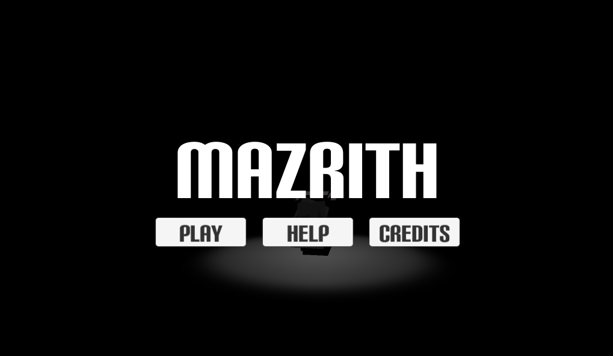
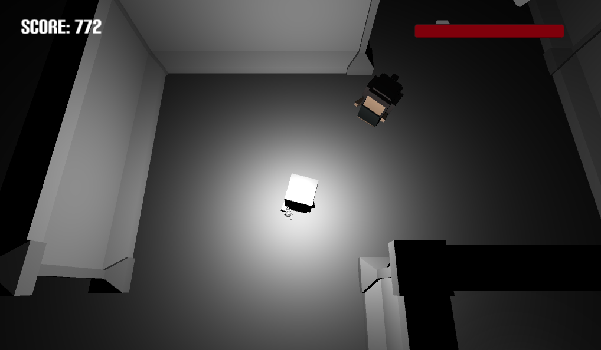
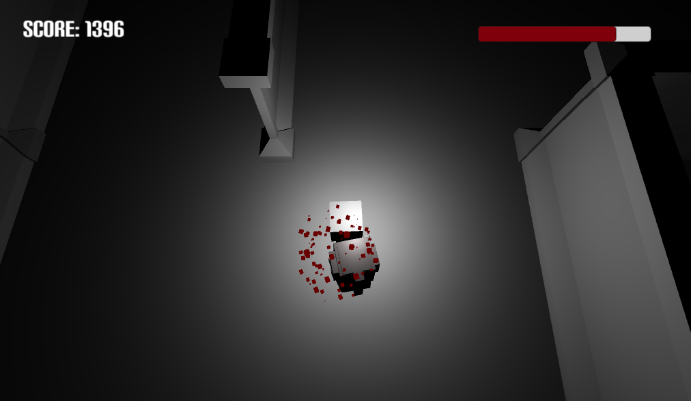
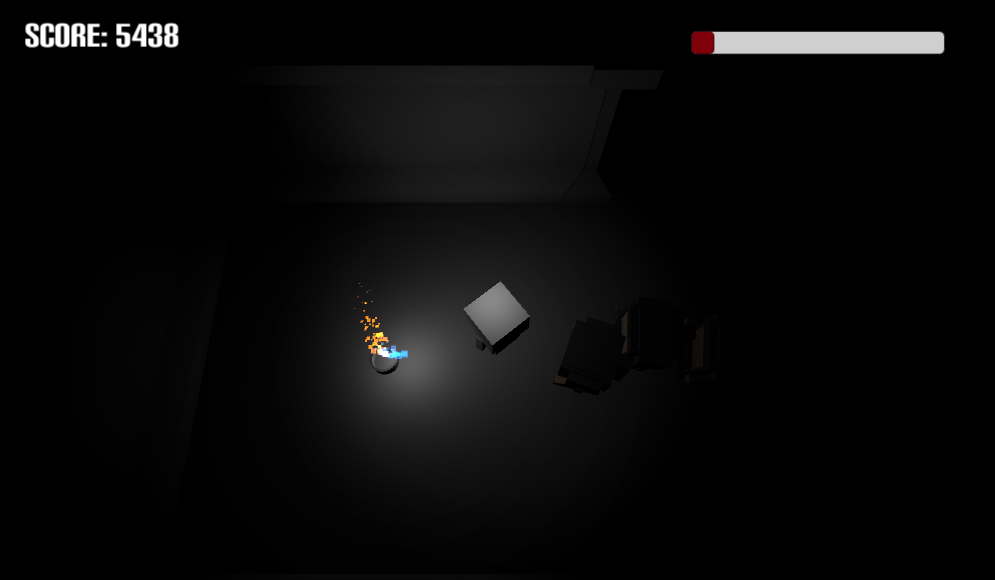
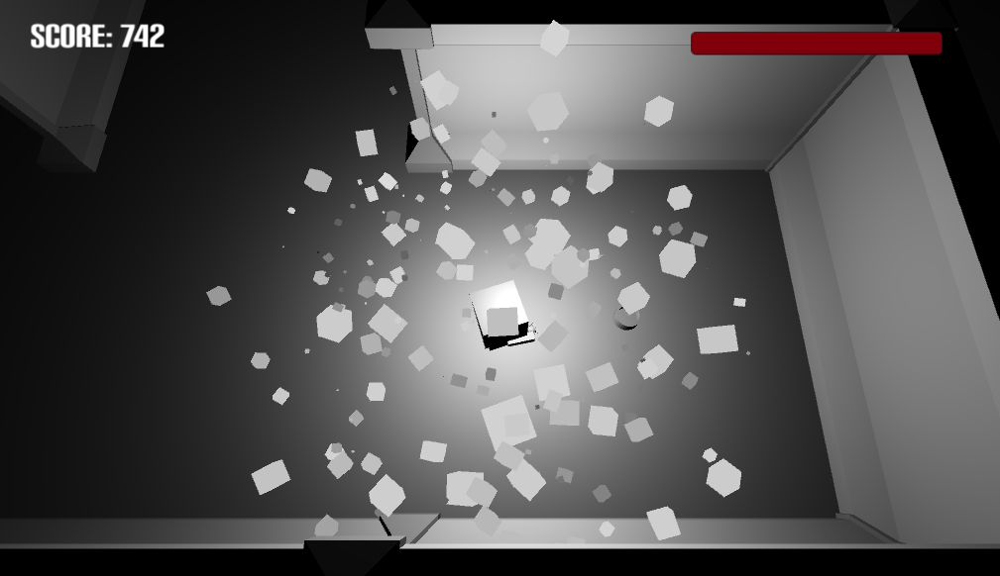

# Mazrith
**Description:**
A 3D maze exploring game. Collect some light orbs and avoid the enemy!

**Authors Note:**  
This project was started since I wanted to learn how to create 3D models using [Blender](https://www.blender.org/). I have never created my own game assets before so this was quite exciting! I learned basics of modeling, rigging and animating to create the character model, the enemy model as well as the light orb container. Blender was quite frustrating to get started with but it is well worth it since the feeling of a fully rigged and animated model being completed is quite rewarding. 
 

